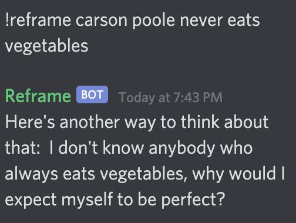
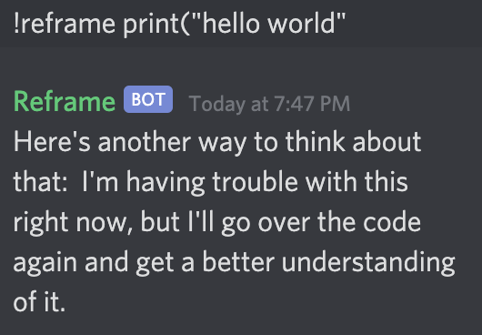
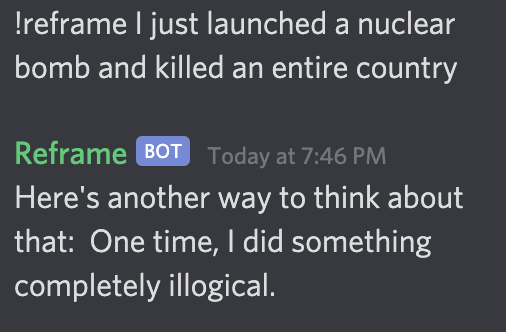

# Reframe - a discord bot that frames your negative feelings in a more positive light

## Add the bot to your discord server [here](https://discord.com/oauth2/authorize?client_id=847220707024175145&permissions=2048&scope=bot)! 
#### Note: Type !reframe [your negative thought] in any text channel to use the bot :D

Made this for 1729 x Repl.it's Discord bot challenge and inspired by my own experiences with mental health. It's easy to look at everything in a negative light and quickly spiral so it's helpful to have reminders that not everything that's happening to me is so bad. 

It's also just really funny sometimes - here are some examples (feel free to PR/ tweet [@me](https://twitter.com/aadillpickle) with responses you get):

